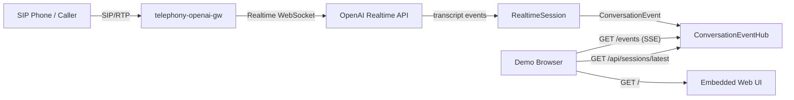
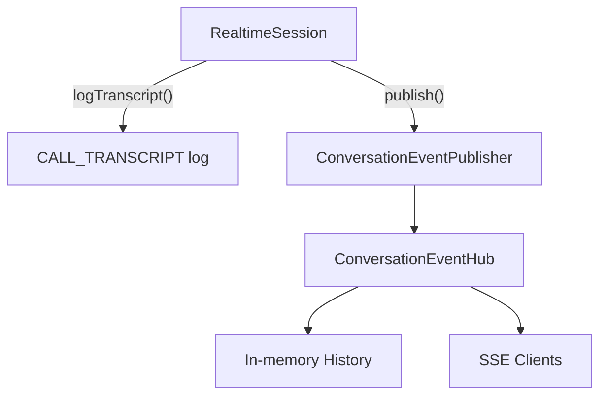

# 会話モニターUI 要件・設計メモ

## 目的

電話発信者と本アプリのAI音声応答のやり取りを、ブラウザ上でLINE風の吹き出しUIとしてリアルタイムに表示する。

本機能は顧客向けデモでの可視化と、音声対話が期待どおり進んでいるかを確認するためのデバッグ支援を目的とする。ユーザー認証、複雑な権限管理、長期保存は初期スコープに含めない。

## 前提

- 既存アプリはJava 21で動作する単一プロセスのGatewayである。
- SIP/RTP処理はPJSUA2 Java bindingを利用する。
- OpenAI Realtime APIから、発信者側transcriptとAI応答transcriptを取得済みである。
- 現状は会話テキストを`CALL_TRANSCRIPT`ログとしてstdout/stderrへ出力している。
- デモ環境はRHEL 8.10 on AWS EC2を想定する。
- 開発環境はmacOSを想定する。
- ブラウザUIは認証なしでよいが、公開範囲を絞れる設定は必要とする。

## 機能要件

### 会話表示

- 発信者の発話を左側または一方の色のバブルとして表示する。
- AI応答を右側または別色のバブルとして表示する。
- 発話単位で新しいバブルを追加する。
- 各バブルには最低限、speaker、transcript、発話時刻を表示する。
- 発話の順序はアプリが受信したイベント順に保持する。
- 新しい発話が追加されたら、画面下部へ自動スクロールする。
- 通話が終了しても、直近の会話は画面上で確認できるようにする。

### セッション表示

- 複数通話を扱えるよう、会話イベントには`sessionId`を付与する。
- 初期実装では「最新または現在アクティブな通話」をメインに表示する。
- 将来拡張として、過去セッション一覧から表示対象を切り替えられる構造にする。
- PCなど画面幅が広い場合は右側にセッション選択リストを表示する。
- スマホなど画面幅が狭い場合は、セッション選択リストを画面上部の横スクロール表示に切り替え、会話バブルと重ならないようにする。

### リアルタイム更新

- ブラウザを開いた状態で、新しい発話が発生したら自動的に画面へ反映する。
- ページ再読み込み時、保持中の直近会話履歴を取得して表示する。
- ブラウザ側からGatewayの通話制御は行わない。初期スコープは表示専用とする。

### 設定

- UI機能の有効/無効を設定ファイルで切り替えられる。
- listen address、port、保持する最大イベント数を設定ファイルで指定できる。
- デフォルトではローカル確認しやすい設定にするが、RHELデモ環境では必要に応じてEC2 security groupやfirewalldで到達元を制限する。

### ログとの関係

- 既存の`CALL_TRANSCRIPT`ログは当面維持する。
- UI表示用にはログ文字列を再パースせず、アプリ内部の会話イベントとして配信する。
- UI機能が停止していても、既存の通話・音声処理・ログ出力に影響しない。

## 非機能要件

- SIP/RTPとOpenAI音声処理のリアルタイム性を阻害しない。
- OpenAI WebSocket listenerやRTP callbackで重いUI処理を行わない。
- ブラウザ未接続時も通話処理が継続できる。
- UI配信先が遅い場合でも、音声処理側にbackpressureをかけない。
- 追加依存は最小限にする。
- RHEL 8.10へのデプロイ手順を大きく複雑化しない。
- 会話内容は個人情報や機密情報を含む可能性があるため、認証なしでもネットワーク公開範囲を明示的に制御できるようにする。

## 推奨アーキテクチャ

### 方針

初期実装では、既存Java Gatewayプロセス内に小さなHTTP serverを内蔵し、静的HTML/CSS/JavaScriptとServer-Sent Eventsを提供する。



### この方針を推奨する理由

- Java 21標準の`com.sun.net.httpserver.HttpServer`で実装でき、Node.jsや外部Web frameworkを追加しなくてよい。
- RHEL環境で追加のnpm build、Node.js runtime、reverse proxyを必須にしなくてよい。
- デモ用途のリアルタイム片方向配信にはWebSocketよりServer-Sent Eventsが単純で十分である。
- 既存の`CALL_TRANSCRIPT`生成箇所から会話イベントをpublishすれば、SIP/RTP処理にはほぼ影響しない。
- 将来、UIを別プロセス化したい場合でも、同じイベントモデルをHTTP APIやWebSocketに差し替えられる。

## 代替案

### 別プロセスのNode.js/TypeScript UI

ブラウザUIとしては作りやすいが、デモ環境のデプロイ単位が増える。Java Gatewayから会話イベントを外部へ出すAPIまたはmessage queueも必要になる。初期デモには過剰と判断する。

### ログファイルtail方式

既存`CALL_TRANSCRIPT`を読み取れば実装は速いが、ログ形式変更に弱く、journald運用やローテーション時の扱いが複雑になる。また、UI表示のためにログをパースする構造は本体設計として不自然である。採用しない。

### Java内蔵WebSocket

双方向操作を追加する場合は候補になる。ただし初期スコープは表示専用であり、SSEの方が実装と接続管理が単純である。初期実装では採用しない。

## コンポーネント設計案

### `ConversationEvent`

会話表示用のimmutable data model。

主なfield:

- `id`: アプリ内で採番するイベントID。
- `sessionId`: 通話セッションID。
- `speaker`: `caller`または`assistant`。
- `text`: transcript本文。
- `timestamp`: 受信時刻。
- `itemId`: OpenAI conversation item ID。
- `responseId`: OpenAI response ID。発信者発話では空の場合がある。
- `final`: 初期実装では常に`true`。将来delta表示をする場合に備える。

### `ConversationEventHub`

会話イベントを受け取り、履歴保持とブラウザ配信を行う。

責務:

- `publish(ConversationEvent event)`でイベントを受け取る。
- 最大件数を超えた古いイベントを破棄する。
- sessionId別に直近履歴を取得できるようにする。
- SSE clientへイベントをfan-outする。
- 遅いclientや切断済みclientを検知して切り離す。

### `ConversationMonitorServer`

Java内蔵HTTP server。

提供endpoint案:

- `GET /`: 会話モニターUIのHTMLを返す。
- `GET /assets/app.css`: UI用CSSを返す。
- `GET /assets/app.js`: UI用JavaScriptを返す。
- `GET /api/sessions`: 保持中sessionの一覧をJSONで返す。
- `GET /api/sessions/latest`: 最新sessionの会話履歴をJSONで返す。
- `GET /api/sessions/{sessionId}`: 指定sessionの会話履歴をJSONで返す。
- `GET /events`: SSEで会話イベントを配信する。

初期実装では静的ファイルをclasspath resourceとしてjar内に含める。既存の手動`javac`起動でも扱いやすくするため、script側で`src/main/resources`をclasspathへ含める。

### `RealtimeSession`との接続

現在の`logTranscript(...)`で、ログ出力に加えて`ConversationEventHub`へpublishする。

設計上は`RealtimeSession`が直接UI serverへ依存しないよう、`ConversationEventPublisher` interfaceを受け取る形にする。



## 設定案

`config/*.yaml`に以下を追加する。

```yaml
monitor:
  enabled: true
  bindAddress: 127.0.0.1
  port: 8080
  maxEvents: 500
  sessionHistoryDepth: 10
```

RHEL EC2で外部ブラウザから直接見る場合は、必要に応じて以下のように設定する。

```yaml
monitor:
  enabled: true
  bindAddress: 0.0.0.0
  port: 8080
  maxEvents: 500
  sessionHistoryDepth: 10
```

ただし認証なしのため、security groupでアクセス元IPを制限することを前提とする。

`monitor.maxEvents`は会話イベント全体の保持数を制御する。`monitor.sessionHistoryDepth`はモニター画面右側のセッション選択リストに残す最近のセッション数を制御し、通話終了後もこの件数内であれば会話履歴を選択して確認できる。
セッション選択リストには`session.<slotId>.name`を表示する。未指定の場合は`slotId`を表示名として扱う。

## UI設計案

### 画面構成

- 上部: 接続状態、現在表示中のsession名。
- 中央: 会話バブル一覧。
- 右側またはスマホ上部: セッション選択リスト。
- 下部: 最新イベントへ追従する表示領域。

### 表示ルール

- `speaker=caller`: 右寄せ、白系。
- `speaker=assistant`: 左寄せ、淡いグリーン系。
- 長文はバブル内で折り返す。
- timestampは小さく表示する。
- 空文字または`unknown` transcriptは表示しないか、デバッグ表示に限定する。

### 接続状態

- SSE接続中: `connected`。
- 再接続中: `reconnecting`。
- 切断中: `disconnected`。

## 実装ステップ案

### Step 1: 会話イベントモデルの追加

- `ConversationEvent`、`ConversationEventPublisher`、`ConversationEventHub`を追加する。
- `RealtimeSession.logTranscript(...)`から会話イベントをpublishする。
- 既存`CALL_TRANSCRIPT`ログは維持する。
- unit testまたは小さな検証コードで履歴保持上限を確認する。

状態: 実装済み。`RealtimeSession`は`ConversationEventPublisher`へtranscriptをpublishし、`GatewayApp`は`ConversationEventHub`を生成して`RealtimeClient`へ渡す。HTTP/SSE配信はStep 2で実装する。

### Step 2: 内蔵HTTP/SSE serverの追加

- `ConversationMonitorServer`を追加する。
- `monitor.enabled`がtrueの場合のみ起動する。
- `GET /api/sessions/latest`と`GET /events`を先に実装する。
- Gateway停止時にHTTP serverも停止する。

状態: 実装済み。`ConversationMonitorServer`はJDK標準の`HttpServer`で起動し、`GET /api/sessions`、`GET /api/sessions/latest`、`GET /events`を提供する。SSE clientごとに短いqueueを持たせ、会話イベントpublish側をHTTP書き込みでブロックしない。

### Step 3: ブラウザUIの追加

- `src/main/resources/monitor/index.html`、`app.css`、`app.js`を追加する。
- SSEで新規イベントを受信し、LINE風バブルとして表示する。
- ページロード時に直近履歴を取得する。

状態: 実装済み。`/`で静的HTMLを返し、`/assets/app.css`と`/assets/app.js`を配信する。UIは`/api/sessions/latest`で直近履歴を読み込み、`/events`のSSEで発話バブルを追加する。

### Step 4: デプロイ手順と運用メモの更新

- READMEに起動後の確認URLを追記する。
- `docs/deployment-guide.md`にRHEL EC2でのport公開、security group注意点、systemd運用時の確認手順を追記する。
- `config/gateway.example.yaml`と`config/gateway.pjsua2.example.yaml`に`monitor`設定例を追加する。

## リスクと対策

### 認証なしUIの公開リスク

会話内容がブラウザで閲覧できるため、`bindAddress: 0.0.0.0`で公開する場合はEC2 security groupでアクセス元IPを限定する。初期デフォルトは`127.0.0.1`を推奨する。

### 音声処理への影響

SSE配信や履歴保持は軽量だが、OpenAI listener上でclientへの書き込みを直接行うと遅延要因になる。`ConversationEventHub`内で短いqueueまたは専用executorを使い、publish側をブロックしない。

### transcript確定タイミング

Realtime APIのtranscriptは音声より遅れて確定する場合がある。UI表示は「発話が確定したタイミング」で追加されるため、音声再生と完全同期しない可能性がある。デモ用途では許容し、必要になればdelta表示を追加する。

### 複数通話

初期UIは最新session中心とする。将来、同時複数通話を扱う場合はsession一覧と切り替えUIを強化する。

## 未決事項

- デモ時にブラウザはGatewayと同じ端末で開くか、EC2へ外部ブラウザからアクセスするか。
- 初期UIで過去session切り替えを必須にするか。
- transcriptをメモリだけに保持するか、デモ後の振り返り用にファイル保存も行うか。
- UIのport番号を`8080`でよいか。

## 初期結論

初期実装は、既存Gatewayプロセス内に認証なしの軽量会話モニターを追加する方針が妥当である。

追加する主な改修は、会話イベントの内部publish、メモリ履歴、SSE配信、静的ブラウザUI、設定項目、デプロイ手順更新である。Node.js/TypeScriptや外部Web serverは現段階では不要と判断する。
