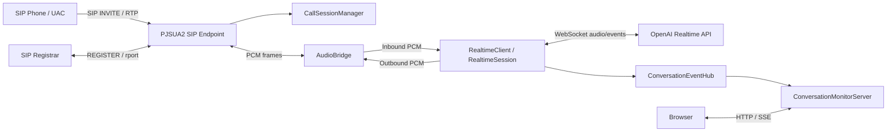

# Telephony OpenAI Gateway システム設計書

## 目的

本書は、`telephony-openai-gw`の現行実装を後から追跡・変更できるように整理した設計ドキュメントである。SIP/RTP、OpenAI Realtime API、会話モニターUI、マルチセッション制御、デプロイ構成を対象とする。

仕様変更時は、実装・設定例・運用手順に加えて、本書とdraw.io図も同じ変更単位で更新する。

## 関連図

draw.ioで編集できる図は以下に格納する。

- [telephony-openai-gw-design.drawio](diagrams/telephony-openai-gw-design.drawio)

このdraw.ioファイルは以下のページを持つ。

- `System Architecture`: システム全体構成
- `Call Flow Sequence`: 1通話の主要シーケンス
- `Class Overview`: 主要クラスと責務の関係
- `Audio Queue Detail`: inbound queue / outbound queueと音声処理の詳細
- `OpenAI Realtime Sequence`: OpenAI Realtime APIとのWebSocketイベントシーケンス

## スコープ

本Gatewayは、SIP/RTP電話音声とOpenAI Realtime APIを接続する軽量なJavaアプリケーションである。PBX機能は持たず、設定された複数の固定セッションスロットごとにSIP UASとしてINVITEを受け、通話ごとにOpenAI Realtime sessionを作成する。

### 対象

- SIP Registration
- UDP/IPv4によるSIP/RTP待ち受け
- PJSUA2 Java bindingによるSIP/RTP制御
- PCMU/G.722のSIP SDP offer/answerとPCM音声ブリッジ
- OpenAI Realtime APIへの音声転送と音声応答受信
- 通話セッションごとの音声キュー分離
- 会話transcriptログとブラウザモニターUI
- RHEL 8.10およびmacOSでの稼働

### 対象外

- PBX機能、ルーティング、転送、保留
- STUN/ICE/TURN
- 認証付きWeb管理画面
- 長期保存DB
- 複数コールを1スロットで同時処理する機能

## 全体アーキテクチャ



### 主要コンポーネント

| コンポーネント | 主な責務 |
| --- | --- |
| `GatewayApp` | 設定読み込み後のコンポーネント生成、起動、停止順序制御 |
| `GatewayConfig` / `GatewayConfigLoader` | 設定ファイルの読み込み、デフォルト値、検証 |
| `PjsipEndpoint` | SIP backendの切り替え。現行は`pjsua2`または`placeholder` |
| `Pjsua2SipEndpoint` | PJSUA2 Endpoint、Transport、Account、Registration、Codec優先度、RTP port範囲制御 |
| `Pjsua2Account` | Registration状態監視、rport/received解析、着信INVITE処理 |
| `Pjsua2Call` | Call state/media state監視、AudioMediaとAudioBridgePortの接続 |
| `Pjsua2AudioBridgePort` | PJSUA2 conference bridgeと`AudioBridge`間のPCM入出力 |
| `CallSessionManager` | 通話セッション生成・終了・最近のセッション履歴保持 |
| `AudioBridge` | セッション別inbound/outbound audio queueとsample rate保持 |
| `RealtimeClient` | セッション別OpenAI Realtime sessionの生成、音声転送worker管理 |
| `RealtimeSession` | OpenAI Realtime WebSocket、音声送受信、transcript、barge-in制御 |
| `ConversationEventHub` | 会話transcript eventの保持とSSE subscriber通知 |
| `ConversationMonitorServer` | ブラウザ向けHTTP/SSE APIと静的asset配信 |

## セッションモデル

本アプリケーションは、設定ファイル上の`gateway.sessionIds`で固定セッションスロットを定義する。各スロットは独立したSIP transport、SIP account、Registration、OpenAI設定を持つ。

```yaml
gateway:
  sessionIds: session-1,session-2

session.session-1:
  name: 一番窓口
  sip.port: 5060
  registration.userName: "1001"
  openai.voice: coral

session.session-2:
  name: 二番窓口
  sip.port: 5062
  registration.userName: "1002"
  openai.voice: shimmer
```

### 制約

- 1スロットにつき同時通話は最大1件。
- 同一スロットで通話中にINVITEを受けた場合は`486 Busy Here`を返す。
- スロット間は独立しており、複数スロットの同時通話は可能。
- SIP側セッションとOpenAI Realtime sessionは1:1で対応する。

## SIP/RTP設計

### SIP Registration

アプリ起動時、各セッションスロットごとにSIP Registrationを行う。PJSIPはViaに`rport`を付与し、Registrarから返る`received`と`rport`を`Pjsua2Account`が解析する。検出したpublic addressは`RegistrationAddressObserver`経由でPJSUA2 transport/contact/media advertisingへ反映する。

STUN/ICEは使用しない。RTP portは設定範囲内の偶数を使用する。

```yaml
session.session-1:
  sip.rtpPortStart: 40000
  sip.rtpPortEnd: 41000
```

### Codec

対応codecは`PCMU`と`G722`である。PJSUA2のcodec priorityを制御し、SDP answerでは設定された優先codecを選択する。

G.722はRTP clock上は`G722/8000`として表現されるが、PJSIP media bridge上のPCM処理は16kHzとして扱う。PCMUは8kHz PCMとして扱う。

## 音声処理設計

詳細なqueue処理はdraw.ioの`Audio Queue Detail`ページに記載する。

### Inbound

1. `Pjsua2AudioBridgePort.onFrameReceived`がPJSUA2からPCM frameを受け取る。
2. `AudioBridge.enqueueInboundPcm16`で通話セッション別inbound queueへ投入する。
3. `RealtimeClient`のセッション別forwarding workerがinbound queueをpollする。
4. `RealtimeSession.appendInputAudio`がOpenAI Realtime APIの24kHz PCMへresampleし、`input_audio_buffer.append`を送信する。

### Outbound

1. OpenAI Realtime APIから`response.output_audio.delta`を受信する。
2. `RealtimeSession`がbase64 PCMをdecodeし、通話のRTP sample rateへdownsampleする。
3. 20ms frame単位で`AudioBridge.enqueueOutboundPcm16`へ投入する。
4. `Pjsua2AudioBridgePort.onFrameRequested`がoutbound queueからPCM frameを取り出し、PJSUA2へ返す。
5. outbound queueが空の場合はsilence frameを返す。

### Queue

```yaml
media:
  inboundQueueCapacity: 500
  outboundQueueCapacity: 10000
```

Queueは通話セッションごとに作成される。capacity値は全セッション共通である。

### Inbound queue詳細

`AudioBridge`は`inboundQueues[sessionId]`として通話セッションごとの`AudioQueue`を持つ。`Pjsua2AudioBridgePort.onFrameReceived`は20ms単位のPCM frameを`AudioFrame(direction=INBOUND)`として投入する。`openai.dropInputAudioWhileAssistantSpeaking`が`true`の場合、AI音声のRTP送話中はこの投入前に発信者音声を破棄する。AI音声のRTP送話を開始した時点で、その時点までに残っている同一セッションのinbound queueも`clearInboundForAssistantSpeaking`で破棄する。`RealtimeClient`は通話セッションごとにforwarding workerを起動し、`pollInbound(sessionId)`でframeを取り出す。

workerが取り出したframeは`RealtimeSession.appendInputAudio`でOpenAI向け24kHz PCMへresampleされ、`input_audio_buffer.append`として送信される。`openai.dropInputAudioWhileAssistantSpeaking`が`true`の場合、queue投入済みframeであってもAI音声のRTP送話中に取り出されたものはOpenAIへ送らず破棄する。barge-in有効時は、この入力PCM frameのRMS音量を使ってAI応答キャンセル条件を評価する。

### Outbound queue詳細

OpenAIから受け取った`response.output_audio.delta`は`RealtimeSession.queueOutputAudio`でdecodeされ、通話のRTP sample rateへdownsampleされる。生成した20ms PCM frameは`AudioFrame(direction=OUTBOUND)`として`outboundQueues[sessionId]`へ投入する。

`Pjsua2AudioBridgePort.onFrameRequested`はPJSUA2からの送話要求ごとに`pollOutbound(sessionId)`する。再生開始時は`OUTBOUND_START_BUFFER_FRAMES=8`を下回る場合にsilenceを返し、短いbufferを作ってから再生を開始する。queueが空の場合もsilence frameを返す。

`RealtimeSession`がOpenAI応答完了を検知すると`markOutboundComplete(sessionId)`を呼び、`Pjsua2AudioBridgePort`はqueueが空になった時点で再生状態を終了する。barge-in条件を満たした場合は`clearOutbound(sessionId)`で未送話のAI音声を破棄する。

## OpenAI Realtime API設計

OpenAI Realtime APIとの詳細なWebSocketイベント順序はdraw.ioの`OpenAI Realtime Sequence`ページに記載する。

### Session生成

`CallSessionManager.createSession`のlistenerとして`RealtimeClient.startSession`が呼ばれる。`RealtimeClient`は通話セッションIDに対応する`RealtimeSession`を作成し、WebSocket接続後に`session.update`を送信する。

### 初回挨拶

通話開始直後、ユーザー発話を待たずに`RealtimeSession.startInitialGreeting`で`response.create`を送信し、スロットごとの`bot.initialGreeting`を発話する。

### Transcript

発信者側は`conversation.item.input_audio_transcription.completed`、AI側は`response.output_audio_transcript.done`をもとにtranscriptをログと`ConversationEventHub`へ発行する。モニターUIはこのeventをSSEで受信する。

### Turn Detection

スロットごとの`openai.turnDetectionType`でOpenAI Realtime APIの発話区切り方式を選択する。通常は`semantic_vad`を使い、`openai.turnDetectionEagerness`で`auto`、`low`、`medium`、`high`を指定する。`low`はユーザー発話を長めに待つ方向の設定である。

`server_vad`を使う場合は、`openai.turnDetectionServerVadThreshold`、`openai.turnDetectionServerVadPrefixPaddingMs`、`openai.turnDetectionServerVadSilenceDurationMs`を`session.update`の`turn_detection`へ渡す。ユーザーが少し間を置いたときにAI応答が早く始まりすぎる場合は、`turnDetectionServerVadSilenceDurationMs`を長くする。

### 主要Realtimeイベント

| 方向 | イベント | 処理 |
| --- | --- | --- |
| Gateway -> OpenAI | `session.update` | model、instructions、voice、transcription、turn_detectionを設定する。 |
| Gateway -> OpenAI | `response.create` | 通話開始直後の初回挨拶を要求する。 |
| Gateway -> OpenAI | `input_audio_buffer.append` | inbound queueから取得したPCMを24kHzへresampleし、base64で送信する。 |
| OpenAI -> Gateway | `input_audio_buffer.speech_started` | ユーザー発話開始候補として記録し、barge-in判定の起点にする。 |
| OpenAI -> Gateway | `input_audio_buffer.speech_stopped` | ユーザー発話停止時刻を記録する。 |
| OpenAI -> Gateway | `input_audio_buffer.committed` | OpenAI側で入力音声がcommitされた時刻を記録する。 |
| OpenAI -> Gateway | `conversation.item.input_audio_transcription.completed` | 発信者側transcriptとしてログとモニターへ発行する。 |
| OpenAI -> Gateway | `response.created` | AI応答開始としてoutbound active状態にする。 |
| OpenAI -> Gateway | `response.output_audio.delta` | AI音声PCMをdecode/downsampleし、outbound queueへ投入する。 |
| OpenAI -> Gateway | `response.output_audio.done` | AI音声delta完了としてoutbound complete状態にする。 |
| OpenAI -> Gateway | `response.output_audio_transcript.done` | AI側transcriptとしてログとモニターへ発行する。 |
| OpenAI -> Gateway | `response.done` | 応答完了、遅延、queue深さなどをログ出力する。 |
| Gateway -> OpenAI | `response.cancel` | barge-in条件成立時に送信し、未送話AI音声を破棄する。 |

## Barge-in制御

AI音声送話中に発信者が話し始めた場合、設定によりAI音声をキャンセルできる。

```yaml
openai:
  cancelResponseOnUserSpeech: true
  dropInputAudioWhileAssistantSpeaking: false
  bargeInMinSpeechMs: 600
  bargeInMinRmsDb: -35.0
  bargeInGraceMsAfterAssistantStarts: 500
```

`dropInputAudioWhileAssistantSpeaking`はbarge-inとは別の制御である。`true`の場合、AI音声をキャンセルせず、AI音声のRTP送話中に受けた発信者音声だけを破棄する。このため、AI発話中のユーザー音声がinbound queueやOpenAI側に蓄積されることを防げる一方で、AI発話中にユーザーが話した内容は会話コンテキストに入らない。

`cancelResponseOnUserSpeech`と`dropInputAudioWhileAssistantSpeaking`が両方`true`の場合、AI音声のRTP送話中は入力破棄を優先する。破棄された音声はOpenAIへ届かないため、その期間のbarge-inキャンセル判定には使われない。

### 判定条件

`cancelResponseOnUserSpeech`が`true`の場合でも、`input_audio_buffer.speech_started`だけではキャンセルしない。以下をすべて満たした場合にキャンセルする。

- OpenAI Realtime APIが`speech_started`を通知している。
- AI音声の出力中である。
- 発話開始から`bargeInMinSpeechMs`以上継続している。
- 直近のinbound PCM frameのRMS音量が`bargeInMinRmsDb`以上である。
- AI音声開始から`bargeInGraceMsAfterAssistantStarts`以上経過している。

条件を満たした場合、`AudioBridge.clearOutbound`で送話待ちAI音声を破棄し、OpenAIへ`response.cancel`を送る。

### 注意点

- 閾値を緩くすると相槌や環境音で止まりやすい。
- 閾値を厳しくすると本来の割り込みが遅れる。
- 実環境のマイク入力レベルに依存するため、デモ環境ごとに`bargeInMinRmsDb`を調整する。

## 会話モニターUI設計

`ConversationMonitorServer`は認証なしのデモ用HTTP serverである。

### API

| Endpoint | 用途 |
| --- | --- |
| `GET /` | モニター画面 |
| `GET /events` | transcript eventのSSE stream |
| `GET /api/sessions` | 最近のセッション一覧 |
| `GET /api/sessions/latest` | 最新セッションと履歴 |
| `GET /api/sessions/{sessionId}` | 指定セッションの履歴 |

### UI

- LINE風の吹き出し表示。
- 発信者発話は右、AI発話は左。
- 右側パネルに最近のセッションを表示する。
- セッション表示名は`session.<slotId>.name`を使う。未指定時は`slotId`を使う。
- 選択中セッションは青系背景と左アクセントで強調する。
- 通話終了後も`monitor.sessionHistoryDepth`件までセッション履歴を選択できる。

```yaml
monitor:
  enabled: true
  bindAddress: 127.0.0.1
  port: 8080
  maxEvents: 500
  sessionHistoryDepth: 10
```

## ログ設計

### 通常ログ

Java標準ログとPJSIP nativeログはstdout/stderrへ出力する。systemd運用ではjournaldへ集約する。

### 要約ログ

主要イベントは`GW_EVENT`形式で出力する。通話調査時は以下で抽出できる。

```sh
grep 'GW_EVENT' apl.log
```

### 会話ログ

会話内容は`CALL_TRANSCRIPT`として出力する。通話内容を含むため、保存・共有時は個人情報や機密情報に注意する。

## デプロイ設計

### macOS開発環境

- Java 21
- PJSIP/PJSUA2 Java bindingをローカルbuild
- `scripts/run-pjsua2-local.sh config/gateway.local.yaml`で検証

### RHEL 8.10デモ環境

- EC2上のRHEL 8.10を想定
- 実行ユーザーは`telephonygw`
- root権限が必要な作業は`sudo`で実行
- PJSIP/PJSUA2 Java bindingはサーバ上でbuild
- systemd serviceとして起動

詳細は以下を参照する。

- [deployment-guide.md](deployment-guide.md)
- [rhel-update-patch-guide.md](rhel-update-patch-guide.md)

## 変更時の更新ルール

以下に該当する変更を行う場合は、本書とdraw.io図を更新する。

- SIP/RTPの呼制御、codec、NAT、RTP port制御を変更する場合
- OpenAI Realtime APIのsession/update/event処理を変更する場合
- 音声queue、resample、barge-in制御を変更する場合
- 複数セッション制御、設定ファイル形式、monitor APIを変更する場合
- デプロイ方式、起動方式、運用ログ方針を変更する場合

仕様変更のcommitでは、原則として実装差分と設計書差分を同じbranch上で管理する。
